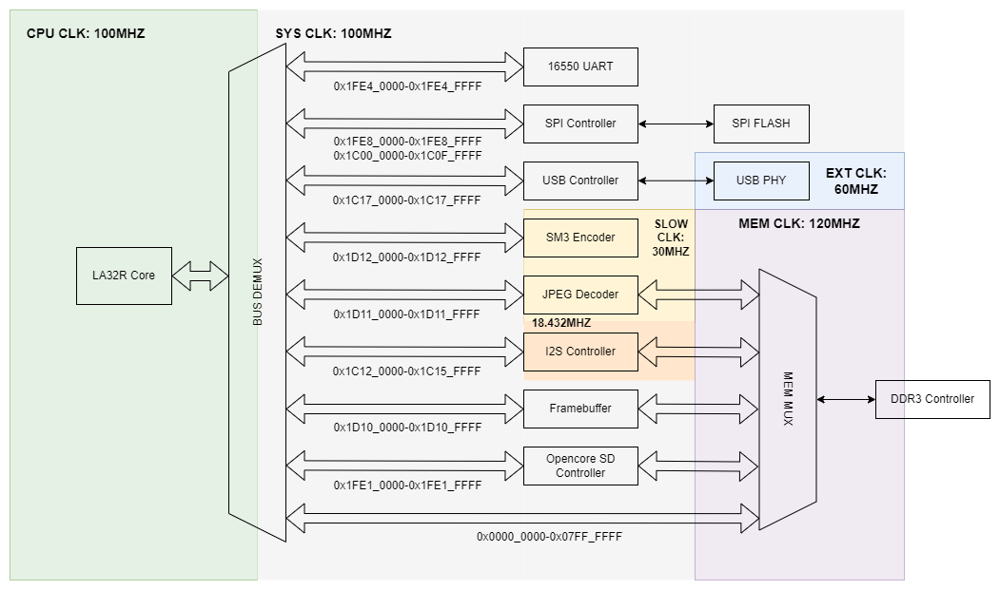

# complex_soc

NSCSCC 2023 Lain Core 项目SoC，在MegaSoC项目架构上增量开发。

支持驱动 SPI FLASH、串口、SD卡、帧缓存(VGA)、USB、DDR3内存、I2S；使用硬件加速模块JPEG Decoder、SM3 Encoder

## 总体架构

## 目录结构

- rtl ：相关源码
  - IP：IP核配置文件
  - modules：使用的各开源模块（sm3除外）
  - SoC：主干模块
    - top.sv：顶层代码
    - soc_top.sv：主体布局
    - xxx_wrapper.sv：各设备控制器
- constraints：约束文件

## 参考链接

- MegaSoC：[SoC](https://github.com/MegaSoC/SoC) 

- pulp-platform：[pulp-axi](https://github.com/pulp-platform/axi) , [common-cells](https://github.com/pulp-platform/common_cells) 
- ultraembedded：[core_jpeg_decoder](https://github.com/ultraembedded/core_jpeg_decoder) , [core_usb_host](https://github.com/ultraembedded/core_usb_host)
- Xilinx IP：略
